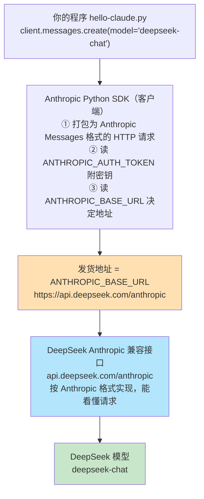

```mermaid
flowchart TD
    App["你的程序 hello-claude.py<br/>client.messages.create(model='deepseek-chat')"]
    SDK["Anthropic Python SDK（客户端）<br/>① 打包为 Anthropic Messages 格式的 HTTP 请求<br/>② 读 ANTHROPIC_AUTH_TOKEN 附密钥<br/>③ 读 ANTHROPIC_BASE_URL 决定地址"]
    BASE["发货地址 = ANTHROPIC_BASE_URL<br/>https://api.deepseek.com/anthropic"]
    DS["DeepSeek Anthropic 兼容接口<br/>api.deepseek.com/anthropic<br/>按 Anthropic 格式实现，能看懂请求"]
    MODEL["DeepSeek 模型<br/>deepseek-chat"]

    App --> SDK
    SDK --> BASE
    BASE --> DS
    DS --> MODEL

    style BASE fill:#ffe0b2
    style DS fill:#b3e5fc
    style MODEL fill:#c8e6c9
```