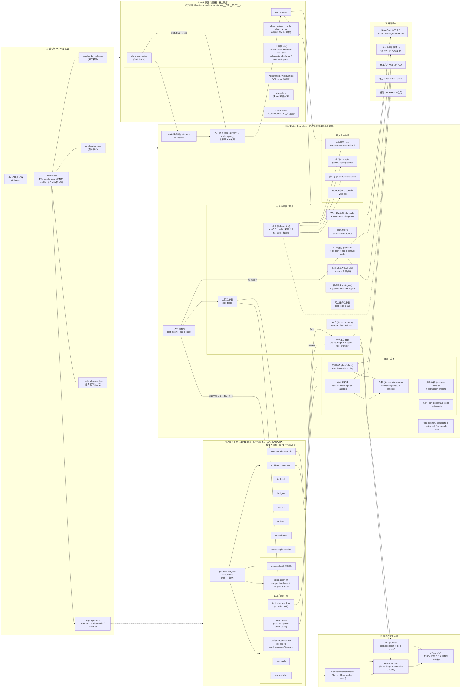
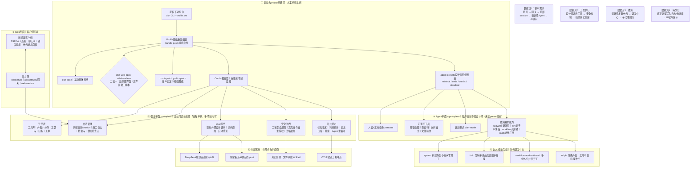

1.快速启动
# 临时安装
npx @deepseek-ai/dsh web 
# 全局安装
npm install -g @deepseek-ai/dsh 

open "/Users/huangbin/Desktop/WorkSpace/NomadMath/ENVDEV/notes/DeepSeek Harness 上手指南.html"

# DeepSeek Harness (DSH) 系统逻辑架构

DSH 是一个基于 **Cordis**（依赖注入 + 插件生命周期框架）的**插件化 Agent Harness**。整个系统由一堆 `@deepseek-ai/dsh-*` 插件（bundle）组成，通过 **Profile 的 patch 层叠加** 组合成一颗 Cordis 容器树。宿主（host）进程承载进程级单例服务，Agent 预设（preset）承载每个会话的模型能力，Web 面把浏览器 UI 以插件 roster 的方式编译进 `window.__DSH_BOOT__`。

## 架构图（Mermaid）

## 分层说明

### ① 启动与 Profile 组装层
`dsh` 命令按 `--profile <name>` 加载对应 profile，profile 是一组**有序 bundle patch 层**（`dsh.profile.bundles` 顺序）叠加：先 `dsh-base`（宿主核心），再 `dsh-web-app`/`dsh-headless`（界面模式），再叠加用户的 `cordis.patch.yml` 与 `--patch` 覆盖层，最终组合出一颗 Cordis 根容器。`agent-presets`（standard / code / cordis / minimal）定义每个会话的 Agent 能力面。

### ② 宿主平面（host plane）
进程级单例，跨会话共享、键控到具体 Session/Agent：
- **注册表**：工具 `tools`、子代理 `subagents`、Skills（按 scope 分层）、目标 `goals`、后台任务 `jobs`。
- **会话管线**：`session` + 持久化（jsonl）、查询（sqlite）、标题、投影（projection）、遥测（OTLP，默认关闭）、检查点。
- **LLM**：`llm` 服务 + `llm-deepseek` 官方适配器 + `llm-pi-ai` 多提供商路由（按 settings 动态注册）+ `llm-retry`。
- **安全边界**：沙箱（workspace-write / danger-full-access）、用户授权（ask / never）、bash/pwsh 沙箱执行器、文件系统观察策略。
- **其他**：system-prompt、token-meter、compaction、spill（大结果外溢）、web 搜索、commands、Agent 运行时（agent-loop）。

### ③ Agent 平面（agent plane）
由每个 **agent preset** 贡献：persona + agent-instructions（身份/指令）、模型可调用工具（bash、fs、skill、goal、todo、web、ask-user、str_replace_editor）、plan-mode（计划模式）、compaction 组，以及**委派/编排工具**（subagent、subagent_fork、subagent-control、workflow、ralph）。预设通过 scope 父子关系被每个会话的 Agent 复用，会话自身状态在插件内部按键区分。

### ④ 委派 / 编排后端
- `subagents` 注册表挂 `spawn`（全新子会话）与 `fork`（继承父对话已完成轮次）两个 provider。
- `workflow-worker-thread` 用 JS 脚本在 worker 线程里扇出多个子代理。
- `ralph` 是逐轮 fresh-agent 迭代（共享工作区做持久记忆）。

### ⑤ Web 表面
宿主侧：`webserver` + `api-gateway`（host-apiproxy，传输无关分发面）+ `web-runtime`。浏览器侧：`dsh.client` 行组成 roster，编译进 `window.__DSH_BOOT__`，其中 `client-connection` 用 fetch/SSE 走 `/api`，`api-remotes` 把宿主服务暴露为 Remote 方法，`ui-*` 插件渲染界面（sidebar、conversation、tool、skill、subagent、jobs、goal、plan、workspace 等）。

### ⑥ 外部系统
DeepSeek 官方 API（chat / messages / search 分开的端点）、pi-ai 多提供商路由、宿主文件系统与 Shell、遥测 OTLP/HTTP 端点。

## 关键数据流

1. **对话主循环**：浏览器 `ui-conversation` → fetch/SSE(`client-connection`) → `/api`(webserver) → `api-gateway` → `api-remotes` → 宿主 `session`/`agent`；`agent-loop` 每轮调用 `llm` 适配器 → DeepSeek API。
2. **工具执行**：模型调用工具 → `tools` 注册表 → 执行器（bash-sandbox / fs-sandbox / subagents / workflow / ralph）→ 经过 `sandbox-policy` + `user-approval` 边界 → 落到宿主 Shell / 文件系统。
3. **委派**：`tool-subagent`(spawn) / `tool-subagent_fork`(fork) → `subagents` 注册表 → spawn/fork provider → 子 Agent；`tool-workflow` → worker 线程 → spawn 多个子代理。
4. **持久化**：会话状态 → jsonl 追加日志 / sqlite 查询 / 附件字节 / storage-json；会话投影（subagent 目录、目标、token 计量）供浏览器列表与 UI 读取。

# 生活化类比：把整套dsh系统类比成【一家定制装修公司】
> 对应6层架构，用装修公司的业务流程，把启动组装、宿主、Agent、委派编排、Web前端、外部合作方全部对应上，尽量简短，映射每一层互动关系。

## 现实角色设定
- **总公司 = dsh软件本体**
- **`dsh --profile xxx` 命令 = 老板下达开工指令，选一套装修方案模板profile**

### ① 启动与Profile组装层（方案组装车间）
> 对应：**装修方案组装部**
1. 老板下达指令（`dsh CLI`），指定方案名字`--profile`；
2. 组装车间**按固定顺序叠图纸（bundle patch层叠加）**：
    1. 先铺通用基建图纸 `dsh‑base`（水电、墙体基础，宿主核心）
    2. 二选一：
       - `dsh‑web‑app`：给客户看的可视化效果图界面（网页UI）
       - `dsh‑headless`：无客户界面，直接跑竣工验收脚本（命令行一次性任务）
    3. 再叠客户自定义修改图纸 `cordis.patch.yml` / `--patch`，覆写改动部分；
3. 全部图纸拼完，生成**完整项目总蓝图：Cordis根容器**；
4. `agent‑presets` = 设计师预设班组：`minimal(极简学徒)` / `cordis(全能总监)` / `code(技术施工组)` / `standard(普通家装组)`，选定本次项目用哪一套设计师能力。

> 现实行为：不是一份固定图纸，是分层叠加，后面的图纸可以修改前面图纸的细节，拼出完整项目。

---

### ② 宿主平面 host‑plane（总公司后台总部，**全公司共享，多个家装项目共用一套后台**）
> 进程级单例，跨会话共享，给每一个装修项目（session会话）提供底层公共能力
- **注册表**：公司工具库（电钻/切割机=tools）、外包小分队（subagents子代理）、施工工艺库（skills）、装修目标清单（goals）、后台排队工单（jobs）
- **会话管线**：每一户家装项目（session）；保存施工日志(jsonl)、档案数据库(sqlite)、项目摘要、进度报表、快照备份检查点
- **LLM服务**：总公司签约的外部设计顾问（DeepSeek），支持多家顾问切换，自动重试沟通失败
- **安全边界**：工地安全规则；哪些地方允许砸墙、哪些严禁动承重梁；改动高危位置需要业主确认授权；工具安全管控
- **其他公共设施**：公司标准话术模板、耗材统计(token计量)、日志压缩、超大图纸临时外存、搜索查资料、内部命令、设计师主循环。

> 关键点：**总部只有一套，同时承接多家客户装修；每个独立家装项目从总部拿公共资源，但是项目之间互相隔离。**

---

### ③ Agent平面 agent‑plane（分配给每户的专属设计师）
> 由上面选好的`agent‑presets`班组模板生成，**一户装修项目配一位专属设计师**
- 设计师人设、工作指令（persona、agent‑instructions）来自预设班组；
- 手里可以调用全套工具：砸墙改文件、查资料、问业主需求、写修改方案、调用总部工具；
- 自带计划模式plan‑mode：设计师自己规划施工步骤；
- **委派工具**：设计师搞不定，可以呼叫外包小分队：派新人从头干活`subagent spawn`；或者把自己已经做了一半的方案交给副手接着做`fork`；跑成套流水线workflow；迭代打磨方案ralph。
> 设计师本身不拥有工具，全部工具来自【总公司宿主平面】，设计师只是拿到使用权；每家项目设计师独立，但是复用总部的工艺模板scope。

---

### ④ 委派 / 编排后端（外包调度中心）
> 设计师要找人帮忙，全部走这个调度中心
1. `spawn`：全新招一组外包，从零开始干活；
2. `fork`：把当前已经做到一半的项目进度复制一份，交给副手继续推进；
3. `workflow‑worker‑thread`：同时派出好多组外包，并行开工；
4. `ralph`：一轮一轮换新外包人员，但是工地现场（工作区）不变，持续迭代优化方案。

---

### ⑤ Web表面（客户手机/电脑网页端）
> 客户看到的小程序/网页
- **公司服务器侧**：总公司web服务器、网关api‑gateway，转发客户请求；
- **浏览器客户侧**：客户打开网页，通过长连接SSE/fetch和总公司通信；网页UI组件渲染聊天窗口、进度、工具记录、外包小组状态、文件目录；
客户在网页发需求 → 网络传给总公司后台 → 交给对应家装项目的设计师Agent处理。

---

### ⑥ 外部系统（外部合作供应商）
外部设计顾问DeepSeek API、多家备选顾问供应商、真实房子的文件/墙体（宿主文件系统、shell）、对外统计上报系统OTLP。

# 三条关键数据流 对应装修场景
1. **对话主循环**：客户在网页输入装修需求 → 网络传给总公司总部 → 找到这个项目对应的专属设计师Agent → 设计师去找外部设计顾问拿方案。
2. **工具执行**：设计师说“砸这面墙” → 去总公司工具库拿电钻 → 先过安全审核：能不能砸？要不要业主同意？ → 才真正对房子动手。
3. **委派**：设计师人手不足，调用外包 → 调度中心分配子代理；可以并行启动多个外包团队干活。
4. **持久化**：每一步施工全部记日志、存数据库；进度报表给客户网页展示。

## 一句话浓缩整个故事
> 你下达装修指令，组装车间把基础基建、界面、自定义修改分层拼出完整项目蓝图；总公司有一套共享的总部后台；为你这个项目派出一名专属设计师；设计师可以调度外包团队干活；你通过网页和设计师沟通；所有施工操作经过安全校验，全程保存施工档案。

如果你需要，我可以把这个类比压缩成适合文档的简短版本，或者画mermaid把装修类比也画出来。

软件系统概念	装修类比概念
dsh CLI	老板下达开工命令
profile + bundle patch	分层叠加装修图纸
Cordis 根容器	完整项目总蓝图
host‑plane 宿主平面	总公司后台总部（全局唯一，多个家装项目共用）
session	一户独立家装项目
agent‑presets	不同能力等级的设计师班组模板
agent‑plane	分配给这一户的专属设计师
spawn / fork / workflow / ralph	外包调度的不同模式
Web 表面	客户浏览器网页
sandbox 安全边界	工地安全、高危操作业主确认授权