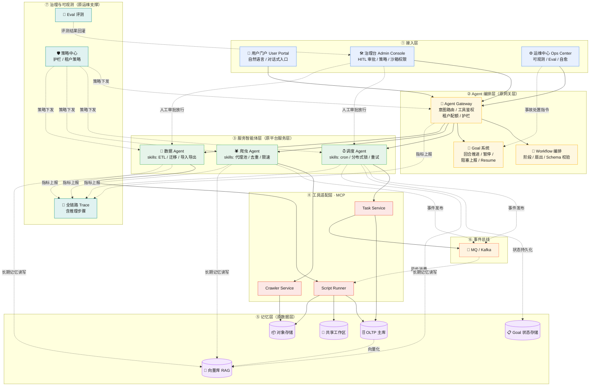

# 微服务架构的 Harness 化（Agentic 化）方案

> 本文承接 `architecture.md`（传统微服务架构），阐述如何将多租户微服务平台改造为
> **DeepSeek Harness 风格的多 Agent 架构**：服务下沉为工具（MCP），编排上升为智能（Agent）。

---

## 1. 核心思想

微服务架构解决的是**"服务按契约被调用"**的问题（确定性编排）；
Agentic 架构解决的是**"系统自己规划、执行、验证、恢复"**的问题（不确定性决策）。

两者的结合点一句话：

> **服务下沉为工具（MCP），编排上升为智能（Agent）。**

传统链路 `网关路由 → 服务调用 → 数据读写` 保持不变（作为确定性底座），
在其上叠加一层 **Agent 编排层**：由 Agent 负责意图理解、任务分解、工具调用、结果验证，
并在关键节点引入**人工审批（HITL）**与**可观测/评测**。

---

## 2. 组件映射表（Harness 化的关键）

| 传统微服务组件 | Harness / Agentic 对应物 | 说明 |
|---|---|---|
| API Gateway（路由/鉴权/限流） | **Agent Gateway**（意图路由 / 工具鉴权 / 租户配额） | 从"转发请求"升级为"决定交给哪个 Agent / 工具链" |
| 服务间同步 RPC 编排链 | **Workflow 编排**（多阶段 / 扇出 / Schema 校验） | 由 Agent 动态规划，而非硬编码调用链 |
| 任务调度器（Cron/重试/DAG） | **Goal 系统 + 调度 Agent** | 定时任务 → "目标 + 自动回合推进"，支持暂停/恢复/阻塞上报 |
| 数据脚本（ETL/迁移/导入导出） | **Tools / Skills**（版本化、沙箱权限、可审计） | 脚本从"手动/定时执行"变为"Agent 可调用的能力" |
| 爬虫工具 | **工具 Agent + Skill**（代理池/去重/限速护栏） | 爬虫从"独立服务"变为"Agent 的工具面" |
| 数据层（OLTP/缓存/仓库/OSS） | **记忆层**（短期上下文 / 向量库 RAG / Goal 状态 / 共享工作区） | 存储之上增加"记忆"语义 |
| 消息队列 | **事件总线 → Agent 间消息**（send_message / 异步扇出） | 异步解耦保留，增加 Agent 消息语义 |
| Admin Console | **治理台**（HITL 审批 / 沙箱权限 / 租户策略 / 审计） | 从"管理后台"变为"人机协作治理面" |
| Ops Center | **可观测 + Eval + 自愈**（Trace 含推理步骤 / 自动评测 / Ralph 循环） | 从"看板"变为"自治运维" |

---

## 3. 三种落地模式（渐进可选）

| 模式 | 做法 | 适用场景 | 侵入性 |
|---|---|---|---|
| **A. Agent 叠加层** | 微服务原样保留，新增 Agent 编排层 + MCP 工具适配层，Agent 通过 MCP 调用现有服务 | 存量系统"长出智能"，风险最低 | 低（新增旁路） |
| **B. 服务 Agent 化** | 每个微服务拥有自己的 Agent 面：意图入口 + 领域工具集 + 领域记忆；服务间 agent-to-agent 通信 | 新建系统或重点服务重构 | 中 |
| **C. 全自治运维** | 运维/调度/数据处理全面自治：Ralph 循环处理事故、Goal 自动推进、失败自愈 | 成熟平台，追求降本增效 | 高（需配套治理） |

**建议路径**：先 A（快速见效）→ 关键服务做 B → 治理成熟后做 C。

---

## 4. Harness 化后的目标架构图



---

## 5. 逐层改造要点

### ① 接入层
- **用户门户**：增加自然语言/对话式入口（如"帮我跑一下上周的流失分析"→ 自动分解为数据脚本 + 报表任务）。
- **Admin Console → 治理台**：新增三类功能——
  1. **HITL 审批**：高危动作（写库、删除、发布、跨租户操作）必须人工放行；
  2. **沙箱权限**：为每个 Agent/工具配置权限级别（只读 / workspace-write / 全量），对齐 Harness 的沙箱模型；
  3. **审计**：Agent 每一步工具调用的留痕与回放。
- **Ops Center**：从"看板"升级为**自愈中枢**——事故告警直接创建 Goal，由 Ralph 循环（无上下文污染的 fresh-agent）处置。

### ② Agent 编排层（网关的进化）
- **Agent Gateway** = 原 API Gateway + 意图路由：输入（NL 或结构化请求）→ 规划 → 分派给具体 Agent 或工具链。
- **Workflow 编排**：跨服务多阶段任务用 Workflow（phases + schema 校验 + 并行扇出），替代硬编码调用链。
- **Goal 系统**：长任务（如"全量数据迁移"）以 Goal 形态运行——自动回合推进、`max_goal_rounds` 上限、阻塞条件上报、暂停/恢复。

### ③ 服务智能体层
- 每个领域服务包装为 **Agent + Skill 集**：
  - 调度 Agent：持有 cron/分布式锁/重试的 Skill，对外暴露"排期一个任务"能力；
  - 爬虫 Agent：持有代理池/去重/限速 Skill，遵守域白名单与合规护栏；
  - 数据 Agent：持有 ETL/迁移/导入导出 Skill，脚本作为 Tools 沙箱化执行。
- Agent 之间通过**事件总线 / send_message** 协作，而非互相直调。

### ④ 工具适配层（MCP）
- 现有微服务通过 MCP 协议暴露为工具（`list_tools → call_tool`），Agent 侧不感知服务部署细节。
- 工具输出必须 **Schema 校验**，防止 Agent 幻觉污染下游状态。

### ⑤ 记忆层（数据层的语义升级）
| 存储 | 记忆语义 |
|---|---|
| OLTP | 业务事实（保持原样） |
| 向量库 RAG | Agent 长期记忆：领域知识、历史决策、相似案例检索 |
| Goal 状态存储 | 长任务进度、回合数、阻塞原因（支撑 Resume） |
| 共享工作区 | Agent 间传递产物（脚本产物、报表、中间数据） |
| 对象存储 | 原始数据（爬虫/导入文件）不变 |

### ⑥ 事件总线
- MQ 保留异步解耦；事件增加 **Agent 语义**（任务事件、审批事件、Goal 状态变更事件）。

### ⑦ 治理与可观测
- **Trace**：全链路追踪扩展至 Agent 推理步骤（规划、工具调用、验证），排障可回放 Agent 决策。
- **Eval**：自动评测 Agent 输出质量（规则 + 样本集），评测结果回灌治理台。
- **策略中心**：护栏（合规、限速、数据最小化）与租户级 Agent 策略统一下发。

---

## 6. 演进路径（落地节奏）

```
Phase 0  工具化：现有服务通过 MCP 暴露为 Tools（不改业务代码）
Phase 1  编排化：网关升级为 Agent Gateway，引入 Workflow 编排 + 意图路由
Phase 2  Goal 化：任务调度器升级为 Goal 系统 + 调度 Agent（暂停/恢复/阻塞上报）
Phase 3  治理化：审批流、沙箱权限、审计、Eval 评测上线
Phase 4  自治化：Ops Center 接入 Ralph 自愈循环，告警→Goal→处置全自动
```

每阶段均可独立上线、可回滚，旧链路（确定性编排）在 Phase 4 前始终可用作降级通道。

---

## 7. 风险与对策

| 风险 | 对策 |
|---|---|
| Agent 不确定性破坏关键交易链路 | 交易路径保留确定性编排；Agent 只介入决策/长尾场景；工具输出 Schema 校验 |
| 幻觉导致错误操作 | HITL 审批 + 沙箱权限 + Eval 评测 + 审计回放 |
| 成本失控（回合数/token/资源） | Goal `max_goal_rounds` 上限、租户 Agent 配额、成本看板 |
| 多租户隔离被 Agent 层破坏 | 租户上下文在 Agent 记忆、工具权限、沙箱边界逐层继承；禁止跨租户工具调用 |
| 旧系统运维复杂度上升 | 双轨运行：确定性降级通道 + 渐进式灰度（按租户灰度 Agent 化） |

---

## 8. 一句话总结

> **Harness 化 = 把"写死的编排"换成"会规划的 Agent"，把"服务的接口"变成"Agent 的工具"，
> 把"人肉运维"变成"自治循环 + 人工审批"，而多租户、数据层、治理体系作为确定性底座原样保留。**
