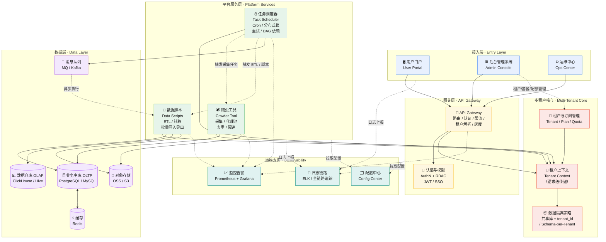

# 系统总体架构图

> 多租户 SaaS 平台 · Admin Console · 任务调度器 · 爬虫工具 · 数据脚本 · 数据层 · API 网关 · 运维中心 · 用户门户

## 架构总览

## 分层职责说明

### 1. 接入层（Entry Layer）
| 组件 | 职责 |
|---|---|
| **用户门户 User Portal** | 面向终端用户的 SaaS 前台，多租户自助登录、业务功能入口 |
| **后台管理系统 Admin Console** | 平台运营人员使用：租户开通/启停、套餐与配额、数据脚本管理、任务监控 |
| **运维中心 Ops Center** | 平台 SRE 使用：服务健康度、任务执行日志、告警处理、灰度发布 |

### 2. 网关层（API Gateway）
- **统一入口**：所有请求先经过网关，做路由转发、认证鉴权、限流熔断。
- **租户解析**：从 `JWT / Header (X-Tenant-ID) / 域名` 解析出租户上下文并向下游透传，是"多租户"的第一道关口。
- 支持灰度发布（按租户灰度）与全链路日志打点。

### 3. 多租户核心（Multi-Tenant Core）
- **租户上下文**：请求级上下文（thread-local / 请求头），保证下游所有组件都知道"当前是哪个租户"。
- **数据隔离策略**（可配置，按租户级别选择）：
  - `共享库 + tenant_id 行级隔离`：成本低，适合中小租户；
  - `Schema-per-Tenant`：逻辑隔离更强，适合大租户/强合规场景；
  - `独立实例`：超大规模或合规客户。
- **租户与订阅管理**：租户生命周期、套餐、配额、计费数据的唯一事实来源。

### 4. 平台服务层（Platform Services）
- **任务调度器 Task Scheduler**：分布式调度（如 XXL-Job / Quartz 集群 / 自研），支持 Cron、分布式锁防重、失败重试、DAG 任务依赖；负责编排爬虫采集与数据脚本执行。
- **爬虫工具 Crawler Tool**：多租户采集任务（可指定目标站点/深度）、代理池与限速防封、URL 去重、原始数据落对象存储。
- **数据脚本 Data Scripts**：ETL 清洗、库表迁移、批量导入导出；可由调度器触发，也可由 Admin Console 手动执行，并通过消息队列异步解耦。

### 5. 数据层（Data Layer）
| 存储 | 用途 |
|---|---|
| 业务主库（OLTP） | 租户业务数据，受隔离策略约束 |
| Redis 缓存 | 热点数据、分布式锁、限流计数 |
| 数据仓库（OLAP） | 统计报表、分析查询，供 Admin Console 与 Ops Center 使用 |
| 对象存储（OSS/S3） | 爬虫原始数据、脚本产物、导入导出文件 |
| 消息队列（MQ） | 任务事件、异步脚本执行、跨服务解耦 |

### 6. 运维支撑（横切关注点）
- **监控告警**：指标采集 + 告警规则，覆盖网关、服务、任务执行。
- **日志链路**：统一日志采集、全链路 TraceID，支撑排障。
- **配置中心**：多环境配置、开关下发，支持租户级配置覆盖。

## 关键交互流程

1. **租户开通**：Admin Console → API Gateway → 租户管理 → 初始化隔离资源 → 返回租户凭证。
2. **用户访问**：User Portal → API Gateway（解析租户）→ 多租户上下文 → 平台服务 → 数据层（按隔离策略路由）。
3. **定时任务**：Task Scheduler 触发 → 分布式锁防重 → 下发爬虫/脚本任务 → MQ 异步执行 → 结果写数据层 → 监控上报。
4. **数据脚本**：Admin Console 手动执行 / Scheduler 定时触发 / MQ 异步触发 → ETL → 数据仓库或对象存储。

## 渲染方式

本图使用 [Mermaid](https://mermaid.js.org/) 编写：

- **VS Code**：安装 "Markdown Preview Mermaid Support" 插件预览；
- **Typora / Obsidian / GitHub**：直接支持 Mermaid 渲染；
- **命令行**：`npx -y @mermaid-js/mermaid-cli -i docs/architecture.md -o docs/architecture.svg`（需要本地安装或代理可用的 Chromium）。
